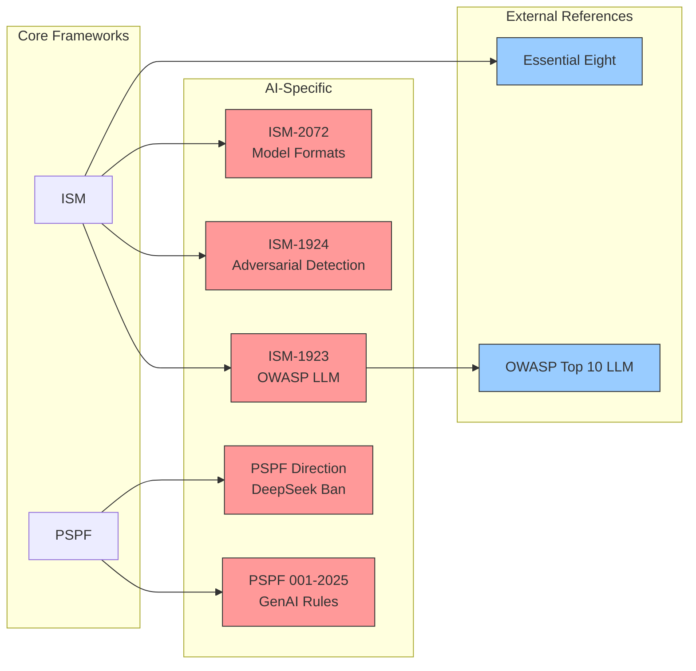
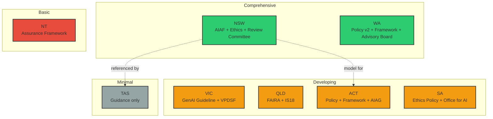
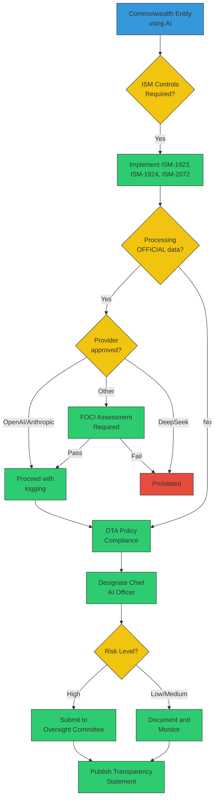
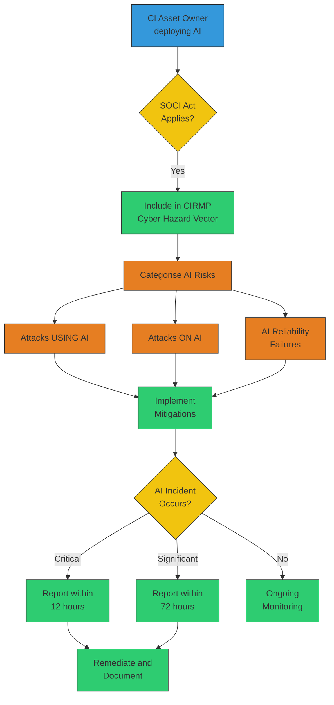
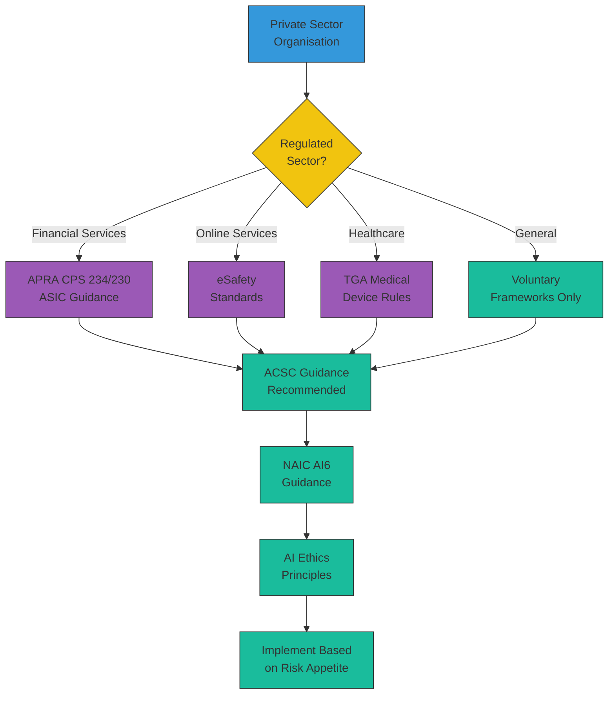

# Knowledge Graph: Australian AI Security Frameworks

> **Visual mapping of framework relationships**

This document provides visual representations of how Australian AI security frameworks connect and relate to each other.

---

## Framework Hierarchy

```mermaid
graph TB
    subgraph Federal["Federal Level"]
        ISM[Information Security Manual]
        PSPF[Protective Security Policy Framework]
        SOCI[SOCI Act / CIRMP]
        DTA[DTA AI Policy v2.0]
        
        subgraph ACSC["ACSC Guidance"]
            ACSC1[Engaging with AI]
            ACSC2[Deploying AI Securely]
            ACSC3[Secure AI Development]
            ACSC4[AI Data Security]
            ACSC5[AI Supply Chain]
            ACSC6[Content Credentials]
            ACSC7[Frontier Models]
        end
        
        subgraph DISR["DISR/NAIC"]
            AI6[AI6 Guidance]
            ETHICS[AI Ethics Principles]
            NAIP[National AI Plan]
            AISI[AI Safety Institute]
        end
    end
    
    subgraph Sector["Sector Regulators"]
        APRA[APRA CPS 234/230]
        ASIC[ASIC Report 798]
        ESAFE[eSafety Standards]
        OAIC[OAIC Privacy]
        TGA[TGA SaMD]
    end
    
    subgraph National["Cross-Jurisdictional"]
        NFAI[National Framework for AI Assurance]
    end
    
    subgraph States["State/Territory"]
        NSW[NSW AIAF]
        VIC[VIC GenAI Guideline]
        QLD[QLD FAIRA]
        WA[WA AI Policy]
        SA[SA AI Ethics]
        ACT[ACT AI Policy]
        NT[NT Assurance Framework]
        TAS[TAS Guidance]
    end
    
    %% Federal relationships
    ISM --> DTA
    PSPF --> DTA
    ISM --> ACSC1
    ISM --> ACSC2
    
    %% National framework relationships
    NFAI --> NSW
    NFAI --> VIC
    NFAI --> QLD
    NFAI --> WA
    NFAI --> SA
    NFAI --> ACT
    NFAI --> NT
    NFAI --> TAS
    
    %% Ethics principles flow
    ETHICS --> NFAI
    ETHICS --> DTA
    ETHICS --> NSW
    ETHICS --> VIC
    ETHICS --> QLD

    %% National AI Plan relationships
    NAIP --> AISI
    AISI -.-> ACSC1
    NAIP --> ETHICS
    NAIP --> DTA

    %% ISM referenced by states
    ISM -.-> NSW
    ISM -.-> VIC
    ISM -.-> QLD
    ISM -.-> WA
    
    %% Sector flows
    ISM -.-> APRA
    ISM -.-> ASIC
    
    classDef mandatory fill:#ff6b6b,stroke:#333,stroke-width:2px
    classDef voluntary fill:#4ecdc4,stroke:#333,stroke-width:2px
    classDef sector fill:#ffe66d,stroke:#333,stroke-width:2px
    classDef state fill:#95e1d3,stroke:#333,stroke-width:2px
    
    class ISM,PSPF,SOCI,DTA mandatory
    class ACSC1,ACSC2,ACSC3,ACSC4,ACSC5,ACSC6,ACSC7,AI6,ETHICS,NAIP,AISI voluntary
    class APRA,ASIC,ESAFE,OAIC,TGA sector
    class NSW,VIC,QLD,WA,SA,ACT,NT,TAS state
```



---

## Document Relationships

### Federal Framework Dependencies



---

## State Framework Maturity



---

## Compliance Pathways

### Commonwealth Entity



### Critical Infrastructure Owner



### Private Sector (Voluntary)



---

## Entity Relationship Model

For knowledge graph construction, use these entity types and relationships:

### Entity Types

```yaml
entities:
  Document:
    properties:
      - id: string            # e.g., "ISM-2072", "PSPF-ADV-001-2025"
      - title: string
      - version: string
      - date: date
      - url: string
      - status: enum[mandatory, voluntary, guidance, framework, superseded]
      - scope: enum[government, sector, national, all]
      - description: text

  Authority:
    properties:
      - id: string            # e.g., "ACSC", "APRA", "DIGITAL-NSW"
      - name: string
      - abbreviation: string
      - jurisdiction: enum[federal, nsw, vic, qld, sa, wa, tas, nt, act, national, international]
      - type: enum[department, agency, regulator, body, institute, office]
      - parent: Authority     # e.g., ACSC -> ASD
      - website: string

  Control:
    properties:
      - id: string            # e.g., "ISM-1923"
      - title: string
      - requirement: text     # Official control text
      - applicability: text
      - date_added: date
      - external_reference: string  # e.g., "OWASP Top 10 LLM v2.0"

  Sector:
    properties:
      - id: string
      - name: string
      - regulator: Authority
      - soci_designated: boolean  # Under SOCI Act?

  RiskCategory:
    properties:
      - id: string
      - name: string
      - level: enum[low, medium, high, very_high, prohibited]
      - framework: Document
      - description: text

  InternationalFramework:
    properties:
      - id: string            # e.g., "EU-AI-ACT", "NIST-AI-RMF"
      - title: string
      - jurisdiction: string  # e.g., "EU", "US", "UK", "Singapore"
      - status: enum[binding, voluntary, proposed]
      - date: date
      - url: string

  Gap:
    properties:
      - id: string            # e.g., "GAP-01"
      - title: string
      - description: text
      - impact: enum[low, medium, high, critical]
      - effort_to_close: enum[low, medium, high]
      - priority: enum[critical, high, medium, low]

  Standard:
    properties:
      - id: string            # e.g., "ISO-42001-2023", "NIST-AI-100-2"
      - title: string
      - organisation: string  # ISO, NIST, IEEE
      - publication_id: string  # Full publication number
      - status: enum[published, draft, in_development]
      - date: date
      - url: string
```

### Relationship Types

```yaml
relationships:
  ISSUED_BY:
    from: Document
    to: Authority

  REFERENCES:
    from: Document
    to: Document
    properties:
      - type: enum[mandatory, recommended, informative]

  CONTAINS:
    from: Document
    to: Control

  APPLIES_TO:
    from: Document
    to: Sector

  SUPERSEDES:
    from: Document
    to: Document
    properties:
      - date: date

  ALIGNS_WITH:
    from: Document
    to: Standard
    properties:
      - mapping_type: enum[full, partial, referenced]

  REGULATES:
    from: Authority
    to: Sector

  ADDRESSES:
    from: Document
    to: Gap
    properties:
      - coverage: enum[full, partial, none]

  EQUIVALENT_TO:
    from: Document
    to: InternationalFramework
    properties:
      - comparison: text  # How they compare

  MITIGATES:
    from: Control
    to: RiskCategory

  PARENT_OF:
    from: Authority
    to: Authority

  COORDINATES_WITH:
    from: Authority
    to: Authority
    properties:
      - mechanism: string  # e.g., "Five Eyes", "INASI", "Data and Digital Ministers"
```

### Instance Examples

```yaml
# Example: ISM-1923 control and its relationships
instances:
  - entity: Control
    id: "ISM-1923"
    title: "OWASP Top 10 for LLM"
    requirement: "Risks identified in the OWASP Top 10 for Large Language Model Applications are mitigated."
    applicability: "All LLM implementations in Commonwealth entities"
    date_added: "2024-06-01"
    external_reference: "OWASP Top 10 for LLM Applications v2.0 (2025)"

  - relationship: CONTAINS
    from: {type: Document, id: "ISM"}
    to: {type: Control, id: "ISM-1923"}

  - relationship: ISSUED_BY
    from: {type: Document, id: "ISM"}
    to: {type: Authority, id: "ACSC"}

  - relationship: ALIGNS_WITH
    from: {type: Document, id: "ISM"}
    to: {type: Standard, id: "ISO-27001-2022"}
    mapping_type: "full"

  - relationship: ADDRESSES
    from: {type: Document, id: "ISM"}
    to: {type: Gap, id: "GAP-05"}
    coverage: "partial"  # ISM-1924 addresses detection, not pre-deployment test
```

---

## Sample Graph Queries

### Neo4j Cypher Examples

**Find all mandatory documents:**
```cypher
MATCH (d:Document {status: 'mandatory'})
RETURN d.title, d.date
ORDER BY d.date DESC
```

**Find documents that reference ISM:**
```cypher
MATCH (d:Document)-[:REFERENCES]->(ism:Document {title: 'Information Security Manual'})
RETURN d.title
```

**Find compliance path for Commonwealth entity:**
```cypher
MATCH path = (start:Document {title: 'ISM'})-[:REFERENCES*1..3]->(end:Document)<-[:ISSUED_BY]-(auth:Authority)
WHERE auth.jurisdiction = 'federal'
RETURN path
```

**Find all AI controls:**
```cypher
MATCH (d:Document)-[:CONTAINS]->(c:Control)
WHERE c.title CONTAINS 'AI' OR c.title CONTAINS 'LLM'
RETURN d.title, c.id, c.title, c.requirement
```

**Find gaps not addressed by any document:**
```cypher
MATCH (g:Gap)
WHERE NOT EXISTS { MATCH (d:Document)-[:ADDRESSES {coverage: 'full'}]->(g) }
RETURN g.id, g.title, g.impact, g.priority
ORDER BY g.priority
```

**Find international equivalents for Australian frameworks:**
```cypher
MATCH (d:Document)-[:EQUIVALENT_TO]->(intl:InternationalFramework)
RETURN d.title AS australian_framework, intl.title AS international_equivalent, intl.jurisdiction
```

**Find which controls mitigate which risk categories:**
```cypher
MATCH (c:Control)-[:MITIGATES]->(r:RiskCategory)
RETURN c.id, c.title, r.name, r.level
ORDER BY r.level DESC
```

**Find Five Eyes coordination network:**
```cypher
MATCH (a1:Authority)-[coord:COORDINATES_WITH]->(a2:Authority)
WHERE coord.mechanism = 'Five Eyes'
RETURN a1.name, a2.name, coord.mechanism
```

---

## Data Files

Data files for knowledge graph construction are planned for a future release. See the [CHANGELOG](../CHANGELOG.md) for the roadmap.

---

## Visualisation Tools

Recommended tools for visualising the knowledge graph:

| Tool | Purpose | Link |
|------|---------|------|
| **Neo4j** | Graph database and visualisation | [neo4j.com](https://neo4j.com) |
| **Obsidian** | Markdown-based knowledge graph | [obsidian.md](https://obsidian.md) |
| **Kumu** | Relationship mapping | [kumu.io](https://kumu.io) |
| **draw.io** | Diagram creation | [diagrams.net](https://diagrams.net) |
| **Mermaid** | Code-based diagrams | [mermaid.js.org](https://mermaid.js.org) |

---

## Contributing

Help improve the knowledge graph:

1. **Add relationships** - Identify connections between documents
2. **Update metadata** - Correct dates, versions, URLs
3. **Extend coverage** - Add missing documents
4. **Build tools** - Create visualisations or query interfaces

See [CONTRIBUTING.md](../CONTRIBUTING.md) for guidelines.

---

[Back to Index](../README.md) | [Gap Analysis](GAPS.md) | [Inventory](INVENTORY.md)